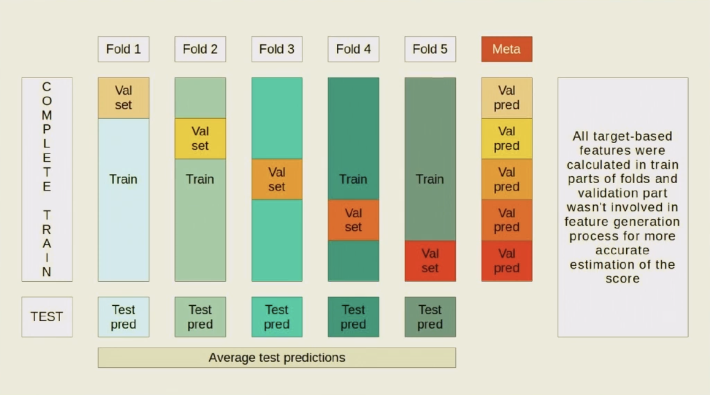
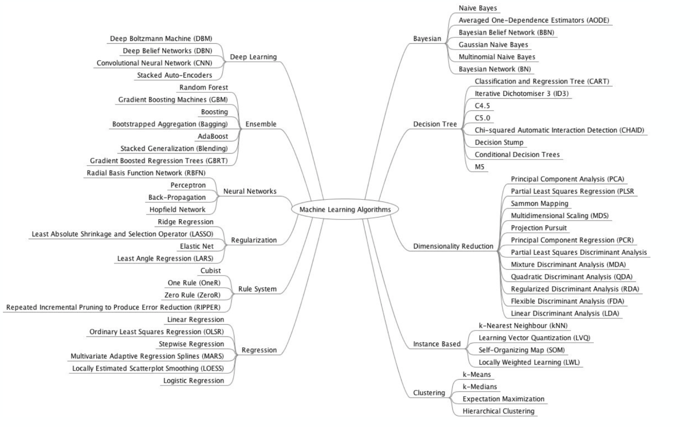

# DS-links
A lot of useful DS links

<a name="table-of-contents"></a>
## Table of Contents
- [Team leading](#team-leading)
- [Books links](#books-links)
- [Business](#business)
- [Courses](#courses)
- [Lists of tools](#lists-of-tools)
- [DS libraries and instruments](#ds-libs)
- [Notebooks](#notebooks)
  - [General](#general-notebooks)
  - [Anomaly detection](#ad-notebooks)
- [Testing in DS](#testing)
- [Metrics in DS projects](#metrics)
- [General DS links](#general-ds-links)
  - [General](#general-ds-links-general)
  - [GAN](#gan)
- [Causal inference](#causal)
- [Reproducibility and automatization](#repa)
- [AI product architecture](#ai-product-architecture)

<a name="team-leading"></a>
## Team leading
- [Лекции по тимлидству](./TeamLeadLectures.md)

- [Требования и обязанности тимлида DS](./TeamLeadSkills.md)

<a name="books-links"></a>
## Books links
- [Books free downloading service (http://libgen.is/)](http://libgen.is/)

- [All IAEA publications (All techical reviews, etc)](https://www.iaea.org/publications/search?keywords=) | [Operation and maintenance of NNPs](https://www.iaea.org/publications/search/topics/operation-and-maintenance-of-nuclear-power-plants?keywords=) | [Nuclear knowledge management](https://www.iaea.org/publications/search/topics/nuclear-knowledge-management?keywords=)

- Bayesian Inference & Graphical Models: Koller09

- Latent Variable Models:	Bishop06

<a name="business"></a>
## Business links (incl. BI)
- [YCombinator 2017 course on youtube](https://www.youtube.com/watch?v=ZoqgAy3h4OM&list=PLQ-uHSnFig5MiLRb-l6yiCBGyqfVyVf17)

- [Harvard Business Review journal](https://hbr.org)

- [Курсы от Сбербанка и Гугла «Бизнес-класс»](https://bc2.business-class.pro)

- [Агрегатор всех источников поддержки вашего бизнеса от Rusbase](https://rb.ru/chance/)

- [DS for Business (Курс от ВШЭ, youtube)](https://www.youtube.com/watch?v=oseHCwDBfSE)

- [54 лучших (DS) инструмента создания аналитических отчетов для бизнеса](https://vc.ru/services/117222-54-luchshih-instrumenta-sozdaniya-analiticheskih-otchetov-dlya-biznesa)

- Алексей Колоколов (Институт бизнес-аналитики) о важности визуализации и как правильно визуализировать информацию и готовить отчеты/дашборды: [Дашборды: интерактивная визуализация данных](https://www.youtube.com/watch?v=ve8aQmE-vBY) | [Монетизация больших данных](https://www.youtube.com/watch?v=3ukGDeaZ7Ao)

<a name="courses"></a>
## Courses
- [Online courses and other DL staff (MIT's Lex Fridman recommendation, fast.ai)](https://www.fast.ai)

- [D. Vetrov Байесовский подход к теории вероятностей. Байесовские рассуждения. Понятие о графических моделях. (поверхностный курс, youtube)](https://www.youtube.com/watch?v=sZxE-BrSMAE)

- [D. Vetrov course on Bayesian methods in ML (youtube)](https://www.youtube.com/watch?v=Ejsr3S79gcQ)

- [K. Vorontsov course on ML (2007)](http://www.ccas.ru/voron/teaching.html#ML)

- [E. Sokolov course on ML (semi-beginners, github)](https://github.com/esokolov/ml-course-hse/tree/master/2016-fall/lecture-notes)

- [Statistical forecasting: notes on regression and time series analysis (duke)](https://people.duke.edu/~rnau/411home.htm)

- [Andrew Ng Deep Learning Course on Youtube](https://www.youtube.com/watch?v=PySo_6S4ZAg)

- [Andrew Ng Anomaly Detection Course on Youtube](https://www.youtube.com/playlist?list=PLwgXNx7TiGV6UH3aEzmdZwzFRwvEnRb0N)

- [Специализация Продвинутое машинное обучение (coursera)](https://www.coursera.org/specializations/aml?#instructors)

- [Machine Learning course by ODS.ai (github)](https://github.com/Yorko/mlcourse.ai)

- [Лекции Алгоритмы и структуры данных (youtube)](https://www.youtube.com/watch?v=eqWzZGNO_XM)

- Lectures on VAE: [Deep Learning Lecture 14: Karol Gregor on Variational Autoencoders and Image Generation](https://www.youtube.com/watch?v=P78QYjWh5sM) | [Variational Autoencoder and Extensions](http://videolectures.net/deeplearning2015_courville_autoencoder_extension/?q=aaron%20courville)

- MLSS/SMILES at Skoltech: [youtube](https://www.youtube.com/c/SMILESSummerSchoolofMachineLearningatSK/videos) | [github 2019](https://github.com/mlss-skoltech) | [github 2020](https://github.com/SummerSchoolMachineLearning)

- [The NVIDIA Deep Learning Institute](https://www.nvidia.com/en-us/deep-learning-ai/education/)

- [Highload: проектирование систем (Олег Бунин)](https://www.youtube.com/playlist?list=PL4_hYwCyhAvZuoK6Y0FaCh-25jEYtBvDo)

- [Обзорный курс LeanDS](https://leands-video-course.thinkific.com/courses/take/leands-mini-course/texts/19443404-leands#)

- [Business Metrics for Data-Driven Companies (coursera course)](https://www.coursera.org/learn/analytics-business-metrics#syllabus)

<a name="lists-of-tools"></a>
## Lists of tools
- [awesome-TS-anomaly-detection](https://github.com/rob-med/awesome-TS-anomaly-detection) - List of tools & datasets for anomaly detection on time-series data

- [(A LOT OF LINKS but not very useful) Machine Learning and Data Science Applications in Industry](https://github.com/ashishpatel26/Real-time-ML-Project#manufacturing)

- [About ML (a lot of the links, in Russian), machinelearning.ru](http://www.machinelearning.ru/wiki/index.php?title=Machine_Learning)

- [(7.2k stars) Awesome production machine learning](https://github.com/EthicalML/awesome-production-machine-learning) - This repository contains a curated list of awesome open source libraries that will help you deploy, monitor, version, scale, and secure your production machine learning.

- [(47.5k stars) Awesome Machine Learning (github)](https://github.com/josephmisiti/awesome-machine-learning) - A curated list of awesome machine learning frameworks, libraries and software (by language).

- [Over 200 of the Best Machine Learning, NLP, and Python Tutorials — 2018 Edition (MIT's Les Fridman recommendation), Medium](https://medium.com/machine-learning-in-practice/over-200-of-the-best-machine-learning-nlp-and-python-tutorials-2018-edition-dd8cf53cb7dc)

- [70 links on ML (for beginners)](https://habr.com/en/company/spbifmo/blog/276479/)

<a name="ds-libs"></a>
## DS libraries and instruments
- Sktime: a Unified Python Library for Time Series Machine Learning: [towardsdatascience](https://towardsdatascience.com/sktime-a-unified-python-library-for-time-series-machine-learning-3c103c139a55) | [github](https://github.com/alan-turing-institute/sktime) | [youtube](https://www.youtube.com/watch?v=Wf2naBHRo8Q)
Per the Github page, sktime currently provides:
```
- State-of-the-art algorithms for time series classification, regression, and forecasting (ported from the Java-based tsml toolkit),
- Transformers for time series: single-series transformations (e.g. detrending or deseasonalization), series-as-features transformations (e.g. feature extractors), and tools to compose different transformers,
- Pipelining for transformers and models,
- Model tuning,
- Ensembling of models — e.g. a fully customizable random forest for time-series classification and regression; ensembling for multivariate problems.
```

- [bayesian_changepoint_detection (online)](https://github.com/hildensia/bayesian_changepoint_detection/tree/master/bayesian_changepoint_detection) - 
Methods to get the probability of a changepoint in a time series. Both online and offline methods are available.

- [Python Outlier Detection (PyOD)](https://github.com/yzhao062/pyod) - PyOD is a comprehensive and scalable Python toolkit for detecting outlying objects in multivariate data. PyOD includes more than 30 detection algorithms

- [Playing with electricity - forecasting 5000 time series](https://spark-in.me/post/playing-with-electricity) - Applying random forests and deep encoder-decoder RNNs to time series prediction + few anomaly detection links

<a name="notebooks"></a>
## Notebooks

<a name="general-notebooks"></a>
#### General
- [COMPREHENSIVE DATA EXPLORATION WITH PYTHON (kaggle)](https://www.kaggle.com/pmarcelino/comprehensive-data-exploration-with-python)

- [Deep Learning Tutorial for Beginners](https://www.kaggle.com/kanncaa1/deep-learning-tutorial-for-beginners)

- [model selection (hyperopt), feature engineering, ensembling](https://habr.com/en/company/mailru/blog/321016/)

- [SIMPLE Feature Engineering Techniques (NAN processing, Label Encode/ Factorize/ Memory reduction, Categorical Features, Splitting, Combining / Transforming / Interaction, Aggregations / Group Statistics) (kaggle)](https://www.kaggle.com/c/ieee-fraud-detection/discussion/108575#latest-631133)

- [Statistical Learning Tutorial for Beginners (incl. CDF) (kaggle)](https://www.kaggle.com/kanncaa1/statistical-learning-tutorial-for-beginners)

- [handling categorical variables (github)](https://github.com/open-data-science/datascience-swiss-knife/tree/master/handling%20categorical%20variables)

- [Bayesian Hyperparameters optimization (github)](https://github.com/open-data-science/datascience-swiss-knife/blob/master/hyperparameters%20optimization/Bayesian%20optimization%20with%20BayesOpt.ipynb)

- [Time Series Classification and Clustering (github)](https://github.com/alexminnaar/time-series-classification-and-clustering)

- [Data Visualization: a lot of seaborn plot types in work (kaggle)](https://www.kaggle.com/kanncaa1/feature-selection-and-data-visualization)

<a name="ad-notebooks"></a>
#### Anomaly detection
- [Fraud detection (Summarizing Konstantin Yakovlev’s view of kaggle competition)](https://www.kaggle.com/c/ieee-fraud-detection/discussion/107697#latest-630007)

- [Fraud detection material/comps in Kaggle](https://www.kaggle.com/c/ieee-fraud-detection/discussion/99987)

- [Anomaly Detection Isolation Forest&Visualization (iForest)](https://www.kaggle.com/adithya44/anomaly-detection-isolation-forest-visualization)

- [Anomaly Detection with Time Series Forecasting (SARIMA, LSTM, Holtwinters)](https://www.kaggle.com/adithya44/anomaly-detection-with-time-series-forecasting)

- Defected products detection: [SECOM Detecting Defected Items (binary classification problem)](https://github.com/sharmaroshan/SECOM-Detecting-Defected-Items) | [Approaches for the class imbalance problem SECOM](https://github.com/Meena-Mani/SECOM_class_imbalance)

- [Bosch Production Line Performance](https://www.kaggle.com/c/bosch-production-line-performance/overview/description) - In this competition, Bosch is challenging Kagglers to predict internal failures using thousands of measurements and tests made for each component along the assembly line. This would enable Bosch to bring quality products at lower costs to the end user.

- [Azure | Deep Learning for Predictive Maintenance (lstms_for_predictive_maintenance incl. RUL)](https://github.com/Azure/lstms_for_predictive_maintenance)

- [RUL, TTF, alot of usefull notebooks](https://github.com/Samimust/predictive-maintenance)

<a name="testing"></a>
## Testing in DS
- [Тесты DS кода для прода (Алексей Могильников)](https://www.youtube.com/watch?v=-Jx9gvUV520)

- [Testing for Data Science Hands-on Guide (Julia Antokhina)](https://www.youtube.com/watch?v=u5NxhpjW4To)

<a name="metrics"></a>
## Metrics in DS projects
- [DS метрики в прокси и бизнес метрики for Predictive Maintenance (researchgate)](https://www.researchgate.net/publication/327982563_Cost-Sensitive_Learning_for_Predictive_Maintenance)

- [Метрики в DS проектах (youtube)](https://www.youtube.com/watch?v=RnvaybU4SCw), Алексей Могильников, Lead DS (2020)

- [Краткий ликбез по ML метрикам и их связи с бизнес-метриками](https://www.youtube.com/watch?v=pDMgvhsUPJM)

<a name="general-ds-links"></a>
## General DS links

<a name="general-ds-links-general"></a>
## General
- [Машинное обучение для людей. Разбираемся простыми словами](https://vas3k.ru/blog/machine_learning/)

- [ods site with ML competitions (from kaggle, drivendata, zindi, etc.)](http://mltrainings.ru)

- [Machine Learning with scikit-learn (interactive slides)](http://amueller.github.io/sklearn_tutorial/#/1)

- [Time Series Analysis (TSA) in Python - Linear Models to GARCH](http://www.blackarbs.com/blog/time-series-analysis-in-python-linear-models-to-garch/11/1/2016)

- AI from US Obama government, 2016: [1](https://obamawhitehouse.archives.gov/sites/whitehouse.gov/files/documents/Artificial-Intelligence-Automation-Economy.PDF) | [2](https://obamawhitehouse.archives.gov/sites/default/files/whitehouse_files/microsites/ostp/NSTC/preparing_for_the_future_of_ai.pdf) | [3](https://obamawhitehouse.archives.gov/sites/default/files/whitehouse_files/microsites/ostp/NSTC/national_ai_rd_strategic_plan.pdf) | [4](https://www.nitrd.gov/PUBS/bigdatardstrategicplan.pdf)

- [Data Science Resources datascienceweekly.org (till 2014)](https://www.datascienceweekly.org/data-science-resources)

- Deep Learning presentation by Sapunov (intento): [Presentation](http://bioinformaticsinstitute.ru/sites/default/files/vvedenie_v_deep_learning.pdf) | [article](https://habr.com/ru/company/oleg-bunin/blog/340184/)

- AutoML (NN): [DARTS: Differentiable Architecture Search (Arxiv)](https://arxiv.org/abs/1806.09055) | [DARTS (github](https://github.com/quark0/darts) | [AutoKeras (arxiv)](https://arxiv.org/abs/1806.10282)

- Models stacking: [Dyakonov](https://dyakonov.org/2017/03/10/cтекинг-stacking-и-блендинг-blending/) | [kaggle](https://www.kaggle.com/arthurtok/introduction-to-ensembling-stacking-in-python)

- [Convert a Time Series to a Supervised Learning Problem](https://machinelearningmastery.com/convert-time-series-supervised-learning-problem-python/)

- [Irregular time series and how to whip them (youtube)](https://www.youtube.com/watch?v=E4NMZyfao2c)

- LSTM: [about+code](https://www.altumintelligence.com/articles/a/Time-Series-Prediction-Using-LSTM-Deep-Neural-Networks) | [youtube (Kaspersky presentational)](https://www.youtube.com/watch?v=QbXVUHhZVVY&feature=youtu.be) | [arxiv (Kaspersky)](https://arxiv.org/pdf/1612.06676.pdf) | [code (Forecasting with LSTMs in Keras)](https://machinelearningmastery.com/multivariate-time-series-forecasting-lstms-keras/) | [code (LSTM Models)](https://machinelearningmastery.com/how-to-develop-lstm-models-for-time-series-forecasting/) | [notebook (local)](http://localhost:8888/notebooks/Dropbox/Forecasting/Time%20Series/LSTM.ipynb) | [AE based on LSTM](https://machinelearningmastery.com/lstm-autoencoders/) | [VAR vs LSTM](https://www.youtube.com/watch?v=_vQ0W_qXMxk)

- [Data preprocessing for machine learning: options and recommendations (by google)](https://cloud.google.com/solutions/machine-learning/data-preprocessing-for-ml-with-tf-transform-pt1)

- [CV scheme, McKinsey’s Datathon: The City Cup](https://www.youtube.com/watch?v=AhBEBZRtpx0)
  <details>
    <summary>cv_scheme</summary>
  
  </details>

- [Deep Image Prior (DIP)](https://dmitryulyanov.github.io/deep_image_prior)

- [Condition Monitoring and Predictive Maintenance from MathLAB](https://www.mathworks.com/help/predmaint/gs/designing-algorithms-for-condition-monitoring-and-predictive-maintenance.html?s_eid=PSM_15028)

- [kalman filters for non rocket scientists](https://www.youtube.com/watch?v=k_MpfzMc9PU)

- [Стас Семенов tinkoff](https://www.youtube.com/watch?v=NVKDSNM702k)

- [Kaggle BNP Paribas — Станислав Семенов](https://www.youtube.com/watch?v=g335THJxkto)

- [(PCA) Machine Learning for Real-Time Anomaly Detection in Network Time-Series Data](https://www.youtube.com/watch?v=0PqzukqMcdA)

- [Кросс-валидация с оценкой значимости изменения и обработкой выбросов (Данила Савенков), youtube (Kaggle Mercedes Benz)](https://www.youtube.com/watch?v=HT3QpRp2ewA)

<a name="gan"></a>
#### GAN
- [Perfect intro (towardsdatascience)](https://towardsdatascience.com/understanding-generative-adversarial-networks-gans-cd6e4651a29)

- [Repo with pytorch GAN implementations](https://github.com/eriklindernoren/PyTorch-GAN)

- [Repo with keras GAN implementations](https://github.com/eriklindernoren/Keras-GAN)

- <details>
    <summary>ML methods cheme</summary>
  
  </details>

<a name="causal"></a>
## Causal inference
- [ODS.ai Causal inference](https://ods.ai/tracks/causal-inference-in-ml-df2020/48dcb402-7d7c-4aa6-893d-d63a34d1092a)

- Improved Shapley method [Asymmetric](https://arxiv.org/abs/1910.06358) | [Causal](https://arxiv.org/abs/2011.01625)

- [Flexibility, Interpretability, and Scalability in Time Series Modeling](https://www.youtube.com/watch?v=LkoriFtcRss)

<a name="repa"></a>
## Reproducibility and automatization
- [Scikit-learn Pipelines](https://www.kdnuggets.com/2017/12/managing-machine-learning-workflows-scikit-learn-pipelines-part-1.html) - Scikit-learn's Pipeline class is designed as a manageable way to apply a series of data transformations followed by the application of an estimator.

- [pdpipe](https://towardsdatascience.com/https-medium-com-tirthajyoti-build-pipelines-with-pandas-using-pdpipe-cade6128cd31) - We show how to build intuitive and useful pipelines with Pandas DataFrame using a wonderful little library called pdpipe.

- [Артур Кузин: DL Pipelines tips & tricks](https://www.youtube.com/watch?v=W5GFH1erQ4U)

- [ODS.ai Machine Learning REPA: Reproducibility, Experiments and Pipelines Automation](https://ods.ai/tracks/ml-repa-df2020)
```
The ML REPA track is traditionally dedicated to the tools and practices of experiment management in Machine Learning, Reproducibility and process automation.
We have a fairly wide range of topics that overlap with the topics of other tracks - ML Infra, SysML, Lean Data Science and others. All these topics are related, and the task of ML REPA is to show how to build a process for developing ML solutions, how to organize teamwork and what tools can help you.
```

- [Kedro](https://github.com/quantumblacklabs/kedro)
```
Kedro is an open-source Python framework that applies software engineering best-practice to data and machine-learning pipelines. You can use it, for example, to optimise the process of taking a machine learning model into a production environment. You can use Kedro to organise a single user project running on a local environment, or collaborate within a team on an enterprise-level project.
```

- Code for reproducibility (Pytorch):
  <details>
    <summary>Details</summary>
  ```python
  def set_determenistic(seed=666, precision=10):
    np.random.seed(seed)
    random.seed(seed)
    torch.backends.cudnn.benchmark = False
    torch.backends.cudnn.deterministic = True
    torch.cuda.manual_seed_all(seed)
    torch.manual_seed(seed)
    torch.set_printoptions(precision=precision)
  ```
  </details>

- Code for reproducibility (Tensorflow):
  <details>
    <summary>Details</summary>
  ```python
  def Random(seed_value):
      # 1. Set `PYTHONHASHSEED` environment variable at a fixed value
      import os
      os.environ['PYTHONHASHSEED'] = str(seed_value)
      # 2. Set `python` built-in pseudo-random generator at a fixed value
      import random
      random.seed(seed_value)
      # 3. Set `numpy` pseudo-random generator at a fixed value
      import numpy as np
      np.random.seed(seed_value)
      # 4. Set `tensorflow` pseudo-random generator at a fixed value
      import tensorflow as tf
      tf.random.set_seed(seed_value)
  ```
  </details>

<a name="ai-product-architecture"></a>
## AI product architecture
- [Архитектура AI продуктов, Михаил Перлин](https://www.youtube.com/watch?v=kbsQRisaJPo) - Архитектура ПО - дисциплина, которая за это отвечает. Что она включает в себя? Каких скиллов и качеств требует? Могут ли DS ею овладеть? Кого звать на помощь, если нужно прямо сейчас? Доклад меньше про технологии и больше про процессы, стратегии и людей.

- [Requirements Specification Template](http://homepages.laas.fr/kader/Robertson.pdf)
